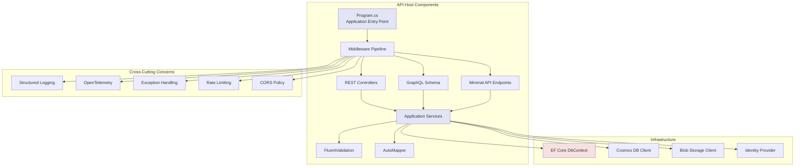
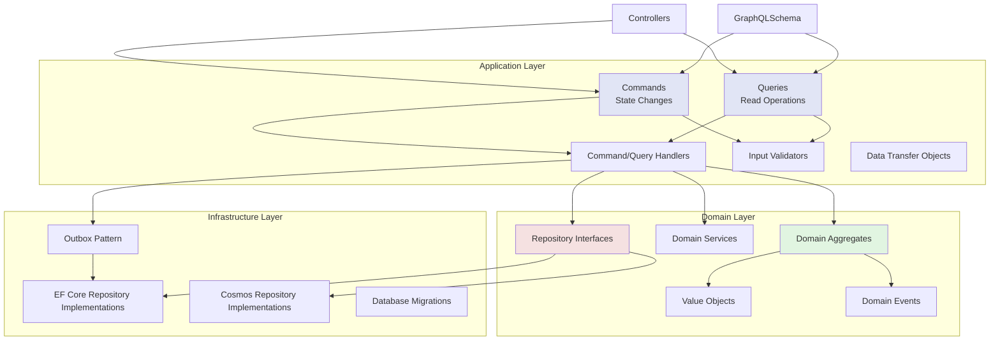
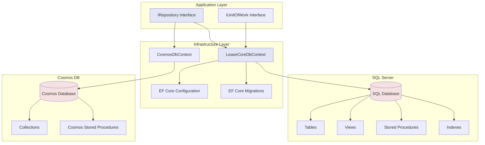
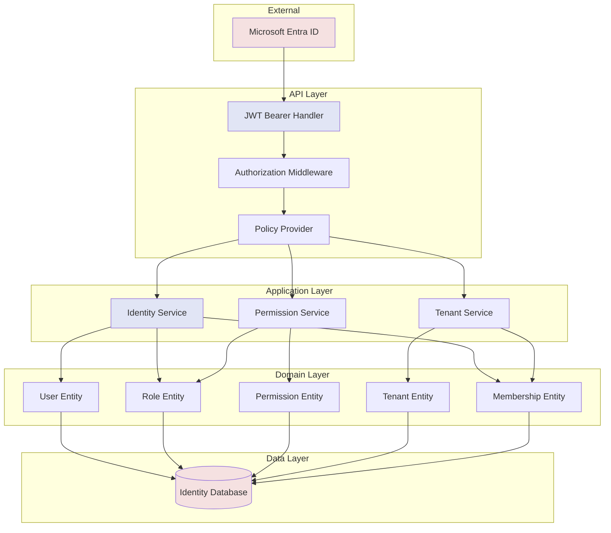

# Component Diagrams

## API Host Component Diagram

```mermaid
flowchart TB
    subgraph "API Host Components"
        Program[Program.cs<br/>Application Entry Point]
        Middleware[Middleware Pipeline]
        Controllers[REST Controllers]
        GraphQLSchema[GraphQL Schema]
        Endpoints[Minimal API Endpoints]
        Services[Application Services]
        Validators[FluentValidation]
        Mappers[AutoMapper]
    end

    subgraph "Cross-Cutting Concerns"
        Logging[Structured Logging]
        Telemetry[OpenTelemetry]
        ExceptionHandling[Exception Handling]
        RateLimiting[Rate Limiting]
        CORS[CORS Policy]
    end

    subgraph "Infrastructure"
        DBContext[EF Core DbContext]
        CosmosClient[Cosmos DB Client]
        BlobClient[Blob Storage Client]
        IdentityService[Identity Provider]
    end

    Program --> Middleware
    Middleware --> Controllers
    Middleware --> GraphQLSchema
    Middleware --> Endpoints

    Controllers --> Services
    GraphQLSchema --> Services
    Endpoints --> Services

    Services --> Validators
    Services --> Mappers
    Services --> DBContext
    Services --> CosmosClient
    Services --> BlobClient
    Services --> IdentityService

    Middleware --> Logging
    Middleware --> Telemetry
    Middleware --> ExceptionHandling
    Middleware --> RateLimiting
    Middleware --> CORS

    style Program fill:#e1e5f5
    style Services fill:#e1e5f5
    style DBContext fill:#f5e1e1
```

## Application Layer Component Diagram

```mermaid
flowchart TB
    subgraph "Application Layer"
        Commands[Commands<br/>State Changes]
        Queries[Queries<br/>Read Operations]
        Handlers[Command/Query Handlers]
        Validators[Input Validators]
        DTOs[Data Transfer Objects]
    end

    subgraph "Domain Layer"
        Aggregates[Domain Aggregates]
        ValueObjects[Value Objects]
        DomainServices[Domain Services]
        DomainEvents[Domain Events]
        Repositories[Repository Interfaces]
    end

    subgraph "Infrastructure Layer"
        EFRepositories[EF Core Repository Implementations]
        CosmosRepositories[Cosmos Repository Implementations]
        Migrations[Database Migrations]
        Outbox[Outbox Pattern]
    end

    Controllers --> Commands
    Controllers --> Queries
    GraphQLSchema --> Commands
    GraphQLSchema --> Queries

    Commands --> Validators
    Queries --> Validators

    Commands --> Handlers
    Queries --> Handlers

    Handlers --> Aggregates
    Handlers --> DomainServices
    Handlers --> Repositories

    Aggregates --> DomainEvents
    Aggregates --> ValueObjects

    Repositories --> EFRepositories
    Repositories --> CosmosRepositories

    Handlers --> Outbox
    Outbox --> EFRepositories

    style Commands fill:#e1e5f5
    style Queries fill:#e1e5f5
    style Aggregates fill:#e1f5e1
    style Repositories fill:#f5e1e1
```

## Data Access Component Diagram

```mermaid
flowchart TB
    subgraph "Application Layer"
        IRepository[IRepository Interface]
        IUnitOfWork[IUnitOfWork Interface]
    end

    subgraph "Infrastructure Layer"
        EFDbContext[LeaseCoreDbContext]
        CosmosContext[CosmosDbContext]
        Configuration[EF Core Configuration]
        Migrations[EF Core Migrations]
    end

    subgraph "SQL Server"
        SQLDatabase[(SQL Database)]
        Tables[Tables]
        Views[Views]
        StoredProcs[Stored Procedures]
        Indexes[Indexes]
    end

    subgraph "Cosmos DB"
        CosmosDatabase[(Cosmos Database)]
        Collections[Collections]
        StoredProcedures[Cosmos Stored Procedures]
    end

    IRepository --> EFDbContext
    IRepository --> CosmosContext
    IUnitOfWork --> EFDbContext

    EFDbContext --> Configuration
    EFDbContext --> Migrations

    EFDbContext --> SQLDatabase
    SQLDatabase --> Tables
    SQLDatabase --> Views
    SQLDatabase --> StoredProcs
    SQLDatabase --> Indexes

    CosmosContext --> CosmosDatabase
    CosmosDatabase --> Collections
    CosmosDatabase --> StoredProcedures

    style IRepository fill:#e1e5f5
    style EFDbContext fill:#e1e5f5
    style SQLDatabase fill:#f5e1e1
    style CosmosDatabase fill:#f5e1e1
```

## Authentication & Authorization Component Diagram

```mermaid
flowchart TB
    subgraph "External"
        EntraID[Microsoft Entra ID]
    end

    subgraph "API Layer"
        JWTHandler[JWT Bearer Handler]
        PolicyProvider[Policy Provider]
        AuthorizationMiddleware[Authorization Middleware]
    end

    subgraph "Application Layer"
        IdentityService[Identity Service]
        TenantService[Tenant Service]
        PermissionService[Permission Service]
    end

    subgraph "Domain Layer"
        User[User Entity]
        Role[Role Entity]
        Permission[Permission Entity]
        Tenant[Tenant Entity]
        Membership[Membership Entity]
    end

    subgraph "Data Layer"
        IdentityDB[(Identity Database)]
    end

    EntraID --> JWTHandler
    JWTHandler --> AuthorizationMiddleware

    AuthorizationMiddleware --> PolicyProvider
    PolicyProvider --> IdentityService
    PolicyProvider --> TenantService
    PolicyProvider --> PermissionService

    IdentityService --> User
    IdentityService --> Role
    IdentityService --> Membership

    TenantService --> Tenant
    TenantService --> Membership

    PermissionService --> Permission
    PermissionService --> Role

    User --> IdentityDB
    Role --> IdentityDB
    Permission --> IdentityDB
    Tenant --> IdentityDB
    Membership --> IdentityDB

    style EntraID fill:#f5e1e1
    style JWTHandler fill:#e1e5f5
    style IdentityService fill:#e1e5f5
    style IdentityDB fill:#f5e1e1
```
